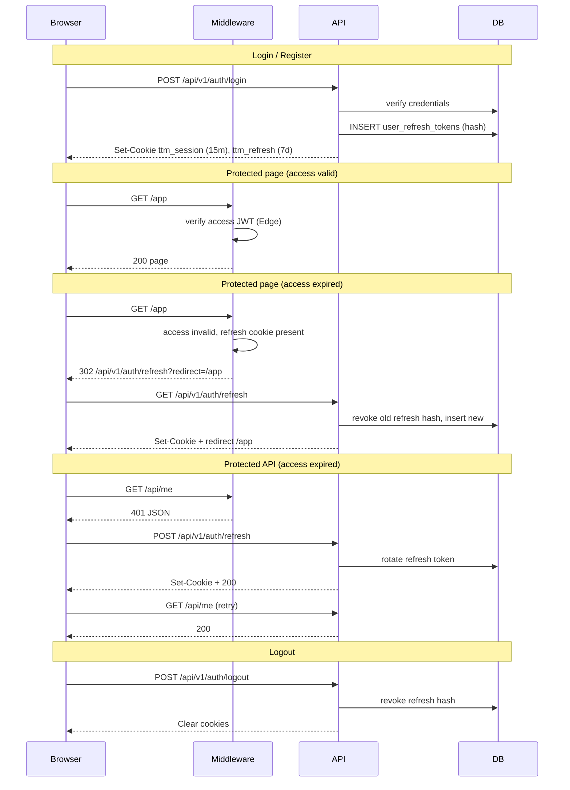

# Authentication flow

Time to Match uses **short-lived access JWTs** (HttpOnly cookie `ttm_session`) and **long-lived refresh tokens** (HttpOnly cookie `ttm_refresh`, hashed in PostgreSQL).

## Flow diagram



## Cookies

| Cookie | Purpose | TTL | HttpOnly |
|--------|---------|-----|----------|
| `ttm_session` | Access JWT (`sub`, `email`) | 15 minutes | yes |
| `ttm_refresh` | Opaque refresh token (stored hashed in DB) | 7 days | yes |
| `ttm_demo_session` | Demo mode only (no `DATABASE_URL`) | 7 days | no |

## Endpoints

| Method | Path | Description |
|--------|------|-------------|
| POST | `/api/v1/auth/login` | Issue access + refresh |
| POST | `/api/v1/auth/register` | Create user + issue tokens |
| POST | `/api/v1/auth/refresh` | Rotate refresh, new access (API clients) |
| GET | `/api/v1/auth/refresh?redirect=` | Browser redirect refresh |
| POST | `/api/v1/auth/logout` | Revoke refresh, clear cookies |

## Middleware

- **Pages** `/app`, `/settings`, `/admin`: valid access JWT or demo session; expired access + refresh cookie → redirect to refresh GET.
- **API** (except public routes): valid access JWT required; returns `401` when expired (client calls refresh).
- **Demo mode** (`DATABASE_URL` unset): `ttm_demo_session` cookie / `x-ttm-demo-session` header.

## Rate limits

Configured in `server/auth/rate-limits.ts`, enforced via Upstash Redis when `UPSTASH_REDIS_REST_*` is set (in-memory fallback otherwise).

| Endpoint | Limit |
|----------|-------|
| login | 20 / 15 min per IP |
| register | 8 / 15 min per IP |
| refresh | 30 / 15 min per IP |
| forgot-password | 5 / 15 min per IP |
| reset-password | 10 / 15 min per IP |

## CSRF

Mutating API handlers using cookie auth should call `verifyCsrfOrigin()` (via `requireAuth()`). Checks `Origin` or `Referer` matches `Host`. Skipped when `Authorization: Bearer` is present.

## Migration

```bash
npm run db:migrate
```

Applies `database/migrations/024_refresh_tokens.sql` — creates `user_refresh_tokens` table.

## Client

Use `authFetch` from `client/lib/auth/fetch.ts` for credentialed requests; retries once after `POST /api/v1/auth/refresh` on `401`.

## Changes from previous system

- Access JWT TTL reduced from **7 days → 15 minutes**.
- Refresh tokens added (`ttm_refresh`), stored **SHA-256 hashed** in PostgreSQL with rotation on each refresh.
- Middleware now guards **protected API routes** (not only pages).
- Logout **revokes** refresh token in DB (previously only cleared cookie).
- CSRF origin check on mutating cookie-authenticated requests via `requireAuth()`.
